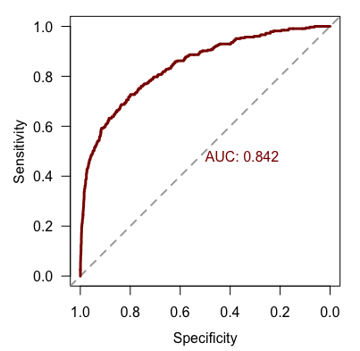
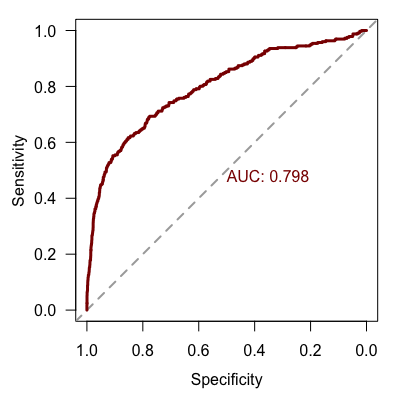
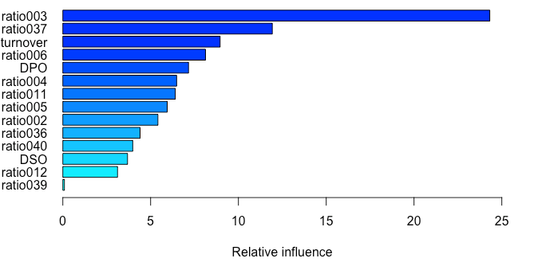

[](http://quantlet.de/)

## [](http://quantlet.de/) **AdaBoost_P2PL** [](http://quantlet.de/)

```yaml

Name of QuantLet : 'AdaBoost_P2PL'


Published in : 'Metis' 


Description : 'AdaBoost classification model for defaults of P2P loans. Compares the out-of-sample predictive performance to a baseline logistic regression model.'


Keywords : 'Boosting, AdaBoost, classification, logistic regression'


Author : 'Konstantin Häusler'

```





